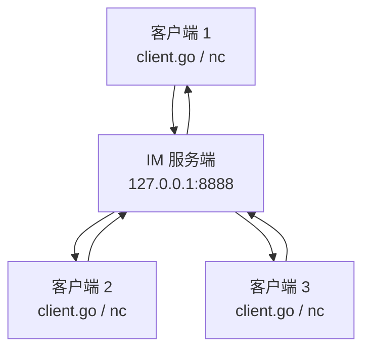
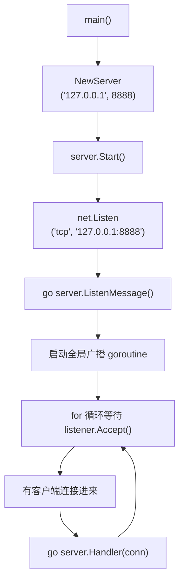
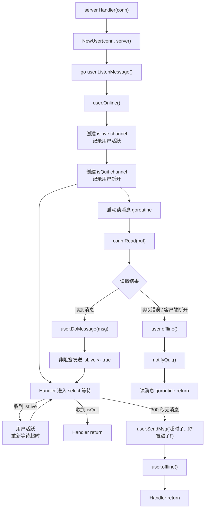
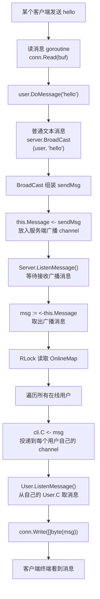
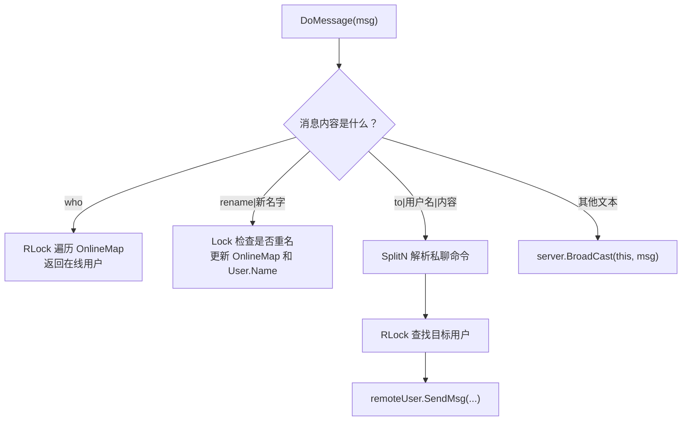
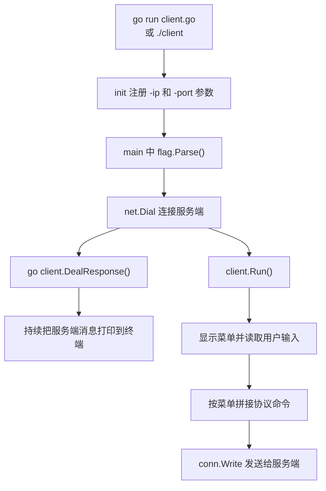
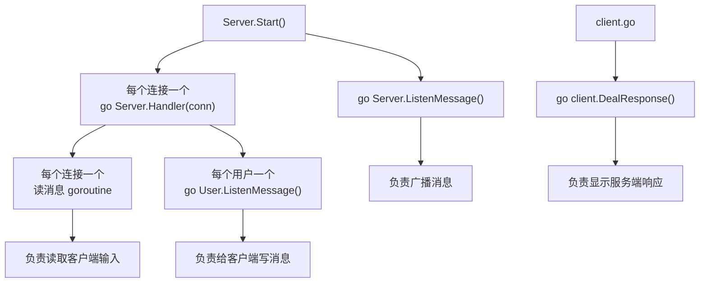

# Go IM System 架构说明

这份文档用更细的方式解释项目内部是怎么跑起来的。建议先读完根目录的 `README.md`，能正常启动服务端和客户端后，再看这份文档。

## 1. 整体视角

这个项目本质上是一个 TCP 命令行聊天室：



服务端负责接收所有客户端连接，并按照消息类型进行处理：

- 普通文本：广播给所有在线用户
- `who`：返回当前在线用户列表
- `rename|新名字`：修改当前用户的用户名
- `to|用户名|消息`：给指定用户发送私聊消息

## 2. 服务端启动流程

入口在 `main.go`：

```go
func main() {
    server := NewServer("127.0.0.1", 8888)
    server.Start()
}
```

启动流程如下：



这里最重要的是：

- `net.Listen` 打开 TCP 监听端口
- `Accept` 阻塞等待客户端连接
- 每来一个客户端连接，都会执行 `go server.Handler(conn)`
- `Start()` 自己继续回到循环里，等待下一个客户端连接

所以服务端可以同时处理多个客户端。

## 3. Server 结构体

`Server` 是服务端的核心对象：

```go
type Server struct {
    Ip        string
    Port      int
    OnlineMap map[string]*User
    mapLock   sync.RWMutex
    Message   chan string
}
```

字段含义：

| 字段 | 作用 |
| --- | --- |
| `Ip` | 服务端监听的 IP |
| `Port` | 服务端监听的端口 |
| `OnlineMap` | 保存当前在线用户，key 是用户名，value 是用户对象 |
| `mapLock` | 保护 `OnlineMap` 的并发读写 |
| `Message` | 服务端广播消息的 channel |

为什么需要 `mapLock`？

因为多个客户端连接对应多个 goroutine。它们可能同时上线、下线、改名、查询在线用户。如果没有锁，多个 goroutine 同时读写 `OnlineMap`，可能触发 Go 的 map 并发读写错误。

当前代码的基本规则是：

- 只读 `OnlineMap`：使用 `RLock / RUnlock`
- 修改 `OnlineMap`：使用 `Lock / Unlock`

## 4. User 结构体

`User` 表示一个在线用户：

```go
type User struct {
    Name        string
    Addr        string
    C           chan string
    conn        net.Conn
    server      *Server
    offlineOnce sync.Once
}
```

字段含义：

| 字段 | 作用 |
| --- | --- |
| `Name` | 用户名，默认是客户端地址，也可以通过 `rename` 修改 |
| `Addr` | 客户端地址 |
| `C` | 当前用户自己的消息 channel |
| `conn` | 当前用户对应的 TCP 连接 |
| `server` | 指向公共的服务端对象 |
| `offlineOnce` | 保证下线清理逻辑只执行一次 |

为什么 `User` 里要保存 `server *Server`？

因为用户业务经常需要访问服务端里的共享资源。例如：

- 上线时要把自己加入 `server.OnlineMap`
- 下线时要从 `server.OnlineMap` 删除自己
- 群聊时要调用 `server.BroadCast`
- 私聊时要从 `server.OnlineMap` 找到对方

为什么需要 `offlineOnce`？

因为同一个用户可能因为不同原因触发下线：

- 客户端主动断开
- 服务端读取连接失败
- 用户 300 秒没有发消息，被超时踢出

如果多个地方同时调用 `offline()`，就可能重复广播“下线”、重复关闭 channel、重复关闭连接。`sync.Once` 可以保证真正的清理代码只执行一次。

## 5. 一个连接的生命周期

每个客户端连接都会进入 `server.Handler(conn)`。



这里有两个核心 channel：

| channel | 类型 | 作用 |
| --- | --- | --- |
| `isLive` | `chan bool` | 读消息 goroutine 通知 Handler：用户刚刚发过消息 |
| `isQuit` | `chan bool` | 读消息 goroutine 通知 Handler：用户已经断开连接 |

`isLive` 和 `isQuit` 都是容量为 1 的 channel：

```go
isLive := make(chan bool, 1)
isQuit := make(chan bool, 1)
```

容量为 1 的好处是：它只需要保存“发生过一次通知”即可，不需要记录发生了多少次。

例如活跃通知使用了非阻塞发送：

```go
select {
case isLive <- true:
default:
}
```

如果 `isLive` 还没满，就放入一个活跃信号；如果已经满了，说明之前已经通知过 Handler 了，就直接跳过，避免读消息 goroutine 被卡住。

`isQuit` 也使用类似方式：

```go
notifyQuit := func() {
    select {
    case isQuit <- true:
    default:
    }
}
```

它的意思是：尽量通知 Handler 退出；如果已经通知过了，就不重复阻塞。

## 6. 广播消息怎么流动

群聊消息不会在 `BroadCast` 里直接写给每个客户端 socket，而是先写入服务端的广播 channel：`Server.Message`。

整体流程如下：



关键代码在 `server.go`：

```go
func (this *Server) BroadCast(user *User, msg string) {
    sendMsg := "[" + user.Addr + "]" + user.Name + ":" + msg

    this.Message <- sendMsg
}
```

`this.Message <- sendMsg` 不是直接把消息发给所有人，而是把消息发送到 `Server.Message` 这个 channel 里。

真正负责“广播给所有在线用户”的是 `Server.ListenMessage()`：

```go
func (this *Server) ListenMessage() {
    for {
        msg := <-this.Message

        this.mapLock.RLock()
        for _, cli := range this.OnlineMap {
            cli.C <- msg
        }
        this.mapLock.RUnlock()
    }
}
```

所以广播可以分成两步：

```text
第一步：BroadCast -> Server.Message -> Server.ListenMessage
第二步：Server.ListenMessage -> 每个 User.C -> 每个 User.ListenMessage -> conn.Write
```

这里有两个容易混的 `ListenMessage`：

| 方法 | 所属对象 | 作用 |
| --- | --- | --- |
| `Server.ListenMessage()` | `Server` | 监听服务端广播 channel，把消息分发给所有在线用户 |
| `User.ListenMessage()` | `User` | 监听当前用户自己的 channel，把消息写回当前客户端 |

`User.ListenMessage()` 当前写法是：

```go
func (this *User) ListenMessage() {
    for msg := range this.C {
        this.conn.Write([]byte(msg + "\n"))
    }
}
```

当 `this.C` 被关闭时，`for range` 会自然结束，这样可以避免 channel 关闭后还一直循环读取空字符串。

## 7. 命令分发

所有客户端发来的文本都会进入 `user.DoMessage(msg)`。



当前支持的协议如下：

| 输入格式 | 作用 | 示例 |
| --- | --- | --- |
| `who` | 查看在线用户 | `who` |
| `rename|新名字` | 修改用户名 | `rename|cheng` |
| `to|用户名|消息` | 私聊 | `to|llo|hello` |
| 普通文本 | 群聊 | `hello` |

私聊命令使用：

```go
strings.SplitN(msg, "|", 3)
```

这样可以避免用户输入不完整的 `to|xxx` 时，代码直接用下标 `[2]` 取值导致 panic。

## 8. 客户端做了什么

`client.go` 是命令行客户端，主要做四件事：



客户端菜单：

```text
1. 公聊模式
2. 私聊模式
3. 更新用户名
0. 退出
```

客户端本质上是把菜单操作转换成服务端能识别的文本协议。

例如更新用户名时，客户端会发送：

```text
rename|cheng
```

私聊时，客户端会发送：

```text
to|llo|hello
```

客户端接收服务端消息依赖：

```go
io.Copy(os.Stdout, client.conn)
```

这行代码会持续从 TCP 连接读取服务端响应，并输出到当前终端。

## 9. 并发模型

项目里主要有这些 goroutine：



简单记忆：

- 服务端有一个全局广播 goroutine
- 每个客户端连接有一个 Handler goroutine
- 每个客户端连接还有一个读消息 goroutine
- 每个用户有一个写消息 goroutine
- 客户端自己还有一个接收服务端响应的 goroutine

这就是 Go 里很典型的 `goroutine + channel + lock` 组合。

## 10. 当前版本的边界

这是一个学习项目，重点是理解流程，所以仍然有一些可以继续优化的地方：

- 服务端 IP 和端口目前写死在 `main.go`
- 服务端启动成功后没有打印日志
- 服务端和客户端都在同一个目录，所以不能直接 `go run .`
- 客户端交互基于 `fmt.Scanln`，不适合输入带空格的长句
- 私聊消息目前不会给发送者回显“发送成功”
- 还没有单元测试和自动化构建

这些都很适合作为后续练习点。
